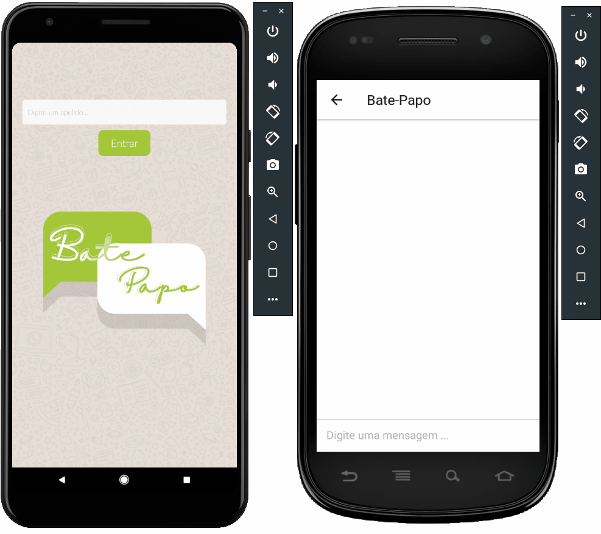

<h1 align="center">
  💬Bate-Papo
</h1>

<br>

<p align="center">
  
</p>

## 🛠 Tecnologias
- [React Native](https://facebook.github.io/react-native/)
- [Javascript](https://devdocs.io/javascript/)
- [Node](https://nodejs.org/en/)
- [firebase](https://firebase.google.com/?hl=pt-br)
- [react-native-router-flux](https://github.com/aksonov/react-native-router-flux)
- [react-native-gifted-chat](https://www.npmjs.com/package/react-native-responsive-screen)
- [react-native-gesture-handler](https://github.com/FaridSafi/react-native-gifted-chat)
- [react-native-screens](https://github.com/software-mansion/react-native-screens)
- [react-native-responsive-screen](https://www.npmjs.com/package/react-native-responsive-screen)

## > Status do Projeto: Em desenvolvimento :warning:
...

## 📱 Executando 

Para executar o projeto é necessário que você tenha o ambiente React Native configurado, você pode seguir esse [GUIA](https://reactnative.dev/docs/environment-setup) para tal.

Depois de configurar o ambiente, basta fazer o clone do projeto:

```sh
git clone https://github.com/JhonatanBergmann/Bate-Papo.git
```

Entre na pasta do projeto e execute o comando para instalar as dependências do projeto:

```sh
yarn install
```
ou
```sh
npm install
```

Em seguida execute o comando referente a plataforma ao qual deseja executar:

Android:

```sh
react-native run-android
```

<p align="center">
 Feito com 💜 by Jhonatan Bergmann
</p>
